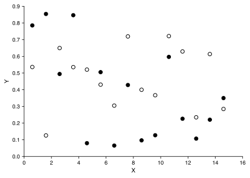
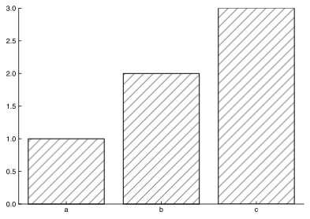
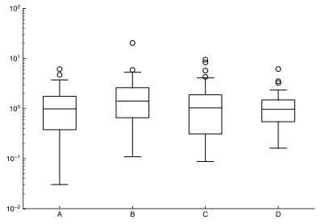
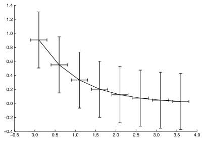
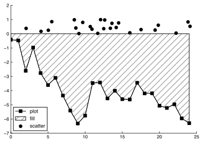

# Textbook Matplotlib Style

*Plotting for the distinguished professional*

This repository contains a matplotlib stylesheet that has taken heavy inspiration from what I believe to be the gold standard of figure-making: *Separation Process Engineering by Phillip C. Wankat*. This textbook has the clearest and most elegantly produced figures that I have ever seen in a technical document. Wankat had-drew all of the figures in that textbook and you can clearly tell he cared deeply about their quality and clarity. If you haven't received a Chemical Engineering degree in the last decade you likely have never used that textbook but if you have, I'm sure it made an impression on you like it did on me.

The choices made in this stylesheet represent the most conservative, old school, methodology for figure making but I continue to believe that if your analysis is good, you don't need fancy colors and figure types to convince someone you know what you are doing.

There are 4 goals in descending priority:

1. Black and white friendly
2. Capable of withstanding many poor quality photocopies
3. Completely non-distracting (no color wanted here!)
4. Use the fewest lines and the least shading as will accommodate your data

This style sheet can only take you so far. You will have to put some effort in to fully realize the ideal set of figures. See the examples below and the code in the examples directory for guidance.

## Installation

To install the style run the following command after cloning this repository. This will create a linked file in the correct directory so any changes to the repo should be reflected in the style automatically.

`make install`

After installation you should be able to load and use the style sheet by simply adding the two lines below to your existing script.

```python
import matplotlib.pylot as plt
plt.style.use("textbook")
```

## Examples
### Scatter Plot




### Bar Plot



### Box Plot



### Error bars



### Legends


